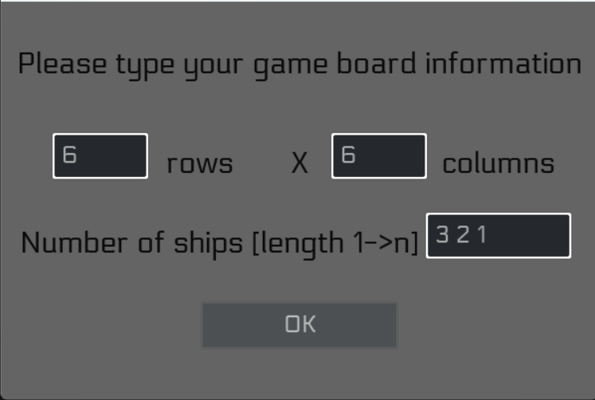
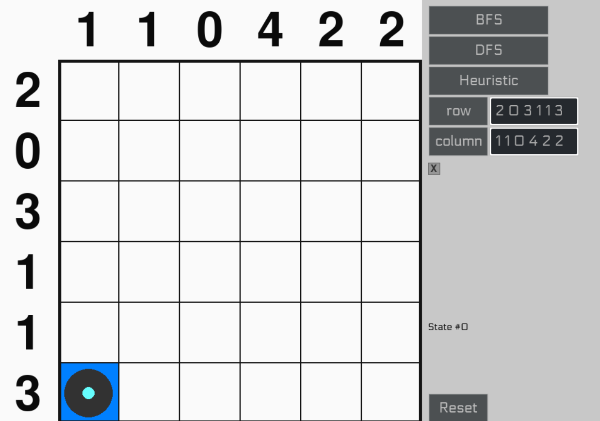
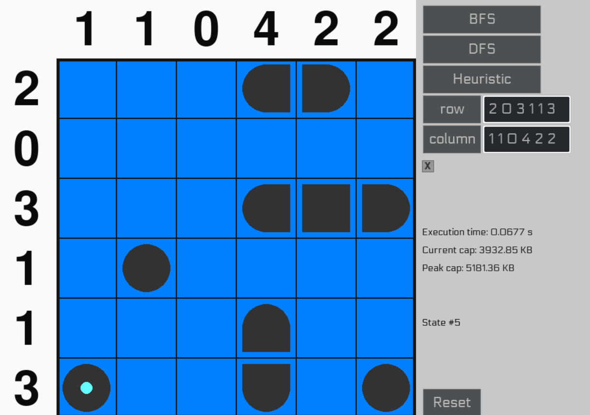

# **Simple AI for battle ships game** 
[Link original game](https://www.puzzle-battleships.com/)
## Built with Pygame and search algorithms (BFS, DFS, A*)
## Example:
- Run main.py
- Input grid size: 6 6 (row and column)
- Input number of ships: 3 2 1
- OK

- Input row: 2 0 3 1 1 3 (then press row)
- Input col: 1 1 0 4 2 2 (then press col)
- Click (left/right) to change cell on grid: change left bottom cell to circle
- Click checkbox to show animation (optional)

- Select solving method: BFS/DFS/Heuristic(A*)
